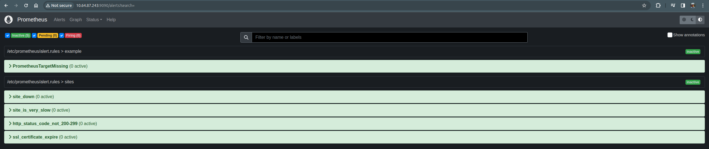
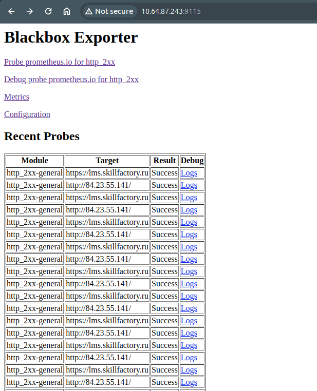
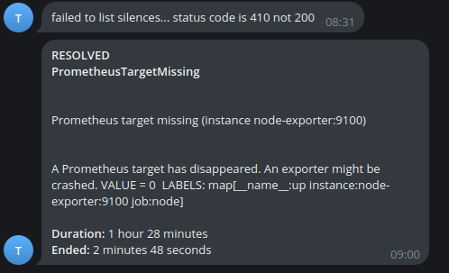

### Установка Grafana Prometheus Alertmanagaer Blackbox Exporter + Настройка TG bot
Исходные файлы для проектной работы размещены в папке [srv](srv )

1. Разверните Prometheus Stack через docker-compose, в котором будет:
* Prometheus;
* Grafana;
* Node Exporter;
* Blackbox Exporter;
* AlertManager.

##### dashboard в Grafana, в котором будут отображены следующие метрики
lms.skillfactory.ru:
* возвращаемый статус-код;
* задержка ответа сайта;
* срок действия сертификата.

.png)

* время работы (Uptime);
* нагрузка на процессор (CPU) в %;
* использование памяти (RAM) в %;
* использование диска в %.

.png)

##### Настроены алерты в AlertManager на следующие события:

* изменился статус-код сайта lms.skillfactory.ru;
* задержка превышает 5 секунд lms.skillfactory.ru;
* сервер перезагрузился (через метрику Uptime).

Исходный файл настройки алертов размещены в папке [srv/prometheus](srv/prometheus)

##### Визуализация Prometheus

##### Визуализация Blackbox

##### Визуализация alert TG

